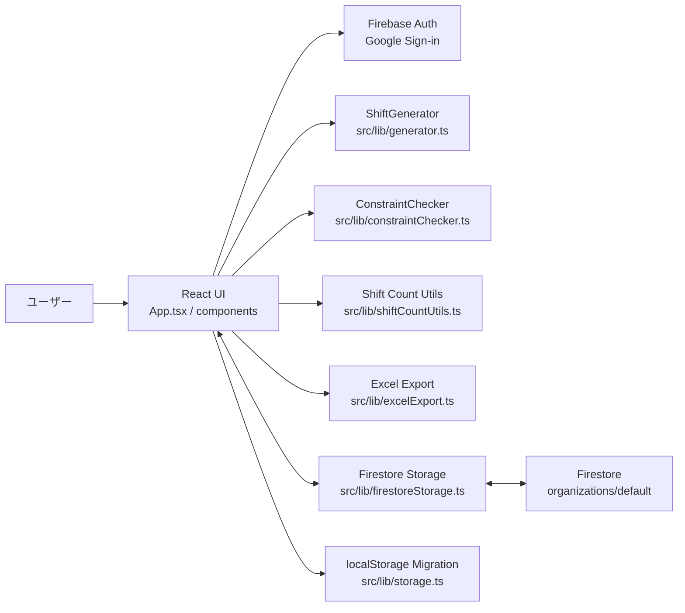
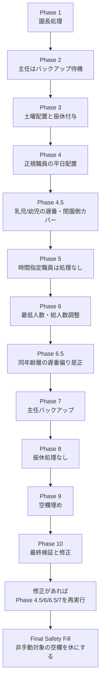
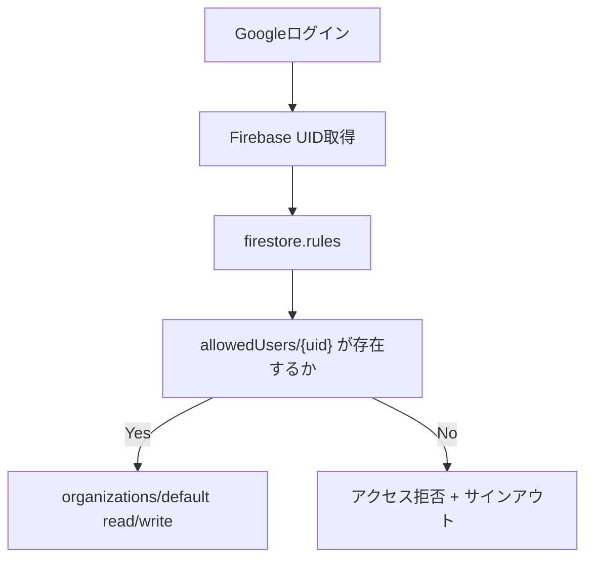

# ShiftPalette 設計書

作成日: 2026-05-04  
最終更新日: 2026-05-25
対象リポジトリ: `ShiftPalette`  
参照元: `shift-scheduler-specification.md`, `シフト生成ロジック.md`, `src/` 実装一式

---

## 1. システム概要

ShiftPalette は、保育園向けの月次シフト作成支援アプリケーションである。職員属性、勤務パターン、勤務可能曜日、土曜保育、休暇・固定予定、時間指定勤務、担当ロール、資格有無などをもとに、月次シフトを自動生成し、手動調整・制約確認・Excel出力までを同一画面で行う。

現在のゴールは、白紙状態から自動生成で実際の手作業シフト表に近い勤務表を作成し、最終的に同等の見た目を持つExcel勤務表として出力することである。

本システムの中心目的は次の4点である。

1. 園が変わっても使えるように、職員・パターン・必要人数を設定化する。
2. 手動入力された有給、振休、研修、出張、保留、時間指定勤務などを保持したまま、自動生成で月次シフトのたたき台を作る。
3. 早番・遅番・閉園側勤務、最低人数、資格者数、担当カバー、勤務条件違反を見える化する。
4. Firestore同期とExcel出力により、作成・調整・共有・印刷までを支援する。

---

## 2. 技術構成

| 項目 | 採用技術 | 実装箇所 |
|---|---|---|
| フロントエンド | React 19 + TypeScript | `src/App.tsx`, `src/components/` |
| ビルド | Vite 7 + vite-plugin-singlefile | `vite.config.ts` |
| 実行環境 | Node.js 20.19.0以上 | `package.json`, `.nvmrc` |
| スタイリング | Tailwind CSS + 独自CSS | `src/index.css`, `src/App.css` |
| 認証 | Firebase Authentication Google Sign-in | `src/lib/auth.ts`, `src/lib/firebase.ts` |
| データ保存 | Firebase Firestore | `src/lib/firestoreStorage.ts` |
| ローカル移行元 | localStorage | `src/lib/storage.ts` |
| Excel出力 | ExcelJS + file-saver | `src/lib/excelExport.ts` |
| アイコン | lucide-react | 各UIコンポーネント |

ビルド成果物は `vite-plugin-singlefile` により単一HTML寄りの構成で出力される。`base: './'` により静的ホスティングに載せやすい。

---

## 3. 全体アーキテクチャ



### 3.1 レイヤー責務

| レイヤー | 責務 |
|---|---|
| UIレイヤー | 月次表表示、セル編集、設定モーダル、職員管理、祝日管理、候補者検索、入替提案、時間帯別人員表示 |
| 生成レイヤー | 手動入力・固定予定を保護しながら月次シフトを自動生成 |
| 制約チェックレイヤー | 手動変更時のハード/ソフト制約違反を判定し、候補者検索や入替提案に利用 |
| 集計レイヤー | 通常シフトと時間指定勤務を統合して、人数・資格者数を集計 |
| 永続化レイヤー | Firestoreリアルタイム同期、localStorageからの移行 |
| 出力レイヤー | 勤務表をExcelファイルとして出力 |

---

## 4. データモデル

### 4.1 Firestore構造

現在の実装では、サブコレクション分割ではなく、単一ドキュメント `organizations/default` に主要データを集約している。

```typescript
interface OrganizationData {
  staff: Staff[];
  schedule: ShiftSchedule;
  settings: Settings;
  holidays: Holiday[];
  patterns: ShiftPatternDefinition[];
  manualShifts: ShiftSchedule;
  timeRangeSchedule: TimeRangeSchedule;
  notes: DailyNotes;
  excelExportLog?: Record<string, string>;
  updatedAt: number;
  updatedBy?: AuditActor;
  lastOperation?: LastOperation;
}
```

| フィールド | 内容 |
|---|---|
| `staff` | 職員マスタ。配列順が画面・Excelの表示順になる |
| `schedule` | 日付別・職員別のシフトID。通常シフトと固定予定を保持 |
| `settings` | 園プロファイル、年度、必要人数、土曜シフト、主任バックアップ上限 |
| `holidays` | 祝日設定 |
| `patterns` | ユーザー編集可能な勤務パターン定義 |
| `manualShifts` | 手動確定されたシフトの印。固定予定、通常シフトの手入力、入替後の確定値を自動生成から保護するために使う |
| `timeRangeSchedule` | 時間指定職員の日別勤務時間 |
| `notes` | 日別備考。Excelの備考行にも出力する |
| `excelExportLog` | 月別のExcel出力履歴 |
| `updatedAt` | 最終保存時刻 |
| `updatedBy` | 最終保存者の Firebase Auth 情報。`uid`, `email`, `displayName` を持つ |
| `lastOperation` | 最終操作の種別、表示ラベル、対象月/日付/職員、対象フィールド、対象日数 |

`organizations/default/auditLogs/{auditLogId}` には、アプリ操作ごとの監査ログを追記する。監査ログは後追い調査用であり、主要データの正本は引き続き `organizations/default` である。

```typescript
interface AuditLog {
  schemaVersion: 1;
  source: 'web-app';
  action: string;
  label: string;
  actor: AuditActor;
  clientAt: number;
  at: FieldValue;
  monthKey?: string;
  targetDate?: string;
  targetStaffId?: number;
  affectedFields?: string[];
  affectedDateCount?: number;
  detail?: Record<string, string | number | boolean | null | string[] | number[]>;
}
```

`organizations/default/backups/{backupId}` には、破壊的操作の直前バックアップを追記する。通常利用者にJSONを見せるのではなく、Firestore内に復旧用の控えとして残す。現行では「当月を白紙に戻す」の実行前に対象月の `schedule`, `timeRangeSchedule`, `manualShifts`, `notes` だけを保存し、バックアップ作成に失敗した場合は削除操作を中止する。

```typescript
interface MonthBackup {
  schemaVersion: 1;
  source: 'web-app';
  reason: 'before_clear_month';
  label: string;
  monthKey: string;
  actor: AuditActor;
  clientAt: number;
  at: FieldValue;
  affectedDateCount: number;
  summary: {
    scheduleDateCount: number;
    timeRangeDateCount: number;
    manualShiftDateCount: number;
    notesDateCount: number;
    scheduleCellCount: number;
    timeRangeCellCount: number;
    manualShiftCellCount: number;
  };
  data: {
    schedule: ShiftSchedule;
    timeRangeSchedule: TimeRangeSchedule;
    manualShifts: ShiftSchedule;
    notes: DailyNotes;
  };
}
```

### 4.2 職員

```typescript
interface Staff {
  id: number;
  name: string;
  position: '園長' | '主任' | '保育士' | 'パート' | '看護師' | '調理';
  shiftType: 'no_shift' | 'backup' | 'regular' | 'part_time' | 'cooking';
  preferredShifts: ShiftPatternId[];
  weeklyDays: number;
  role: 'infant' | 'toddler' | 'free' | 'cooking' | null;
  incompatibleWith: number[];
  earlyShiftLimit: number | null;
  saturdayOnly: boolean;
  hasQualification: boolean;
  availableWeekdays?: StaffWeekday[];
  defaultTimeRange?: TimeRange;
  weeklyTimeRanges?: Partial<Record<StaffWeekday, TimeRange>>;
  floor?: '1F' | '2F' | '3F' | 'free' | 'none';
  employmentStartDate?: string;
  employmentEndDate?: string;
}
```

| 属性 | 用途 |
|---|---|
| `position` | UI表示、園長/主任/看護師/調理の特別処理 |
| `shiftType` | 自動生成対象か、主任バックアップか、時間指定入力か、調理かを決定 |
| `preferredShifts` | 職員ごとに許可する勤務パターンを制限 |
| `weeklyDays` | 週の勤務日数条件 |
| `role` | 乳児・幼児・フリー・調理などの担当 |
| `incompatibleWith` | 同じシフトへの配置を避ける |
| `earlyShiftLimit` | 開園・早め勤務の月間上限判定 |
| `saturdayOnly` | 土曜出勤候補の優先、平日自動生成対象からの除外 |
| `hasQualification` | 資格者集計、資格あり時間指定職員のカウントに利用 |
| `availableWeekdays` | 勤務可能曜日。未設定なら月〜土すべて可 |
| `defaultTimeRange` | 時間指定勤務のデフォルト |
| `weeklyTimeRanges` | 曜日別の固定勤務時間と集計対象シフト。設定がある曜日は `defaultTimeRange` より優先 |
| `floor` | 同一フロア同一シフトを避ける制約に利用 |
| `employmentStartDate` | 在籍開始日。未設定なら過去から在籍している扱い |
| `employmentEndDate` | 在籍終了日。未設定なら終了日なしの扱い |

在籍期間は `YYYY-MM-DD` の文字列で保持する。`getActiveStaffForMonth()` は対象月と在籍期間が1日でも重なる職員を返し、月次表・Excel・職員別シフト分布の表示対象に使う。`getActiveStaffForDate()` / `isStaffActiveOnDate()` は日付単位の生成、固定勤務反映、候補者検索、制約チェック、集計に使う。既存データのように在籍開始日・終了日が未設定の職員は、全期間在籍として扱う。

### 4.3 職員種別の扱い

| 職員 | 自動生成 | 時間指定入力 | 人数集計 | 資格者集計 |
|---|---:|---:|---:|---:|
| 園長 | 対象外 | 可 | 対象外 | 対象外 |
| 主任 | バックアップとして可 | 不可 | 対象 | 資格ありなら対象 |
| 保育士/正社員 | 対象 | `shiftType=part_time` の場合は可 | 対象 | 資格ありなら対象 |
| パート | 対象外 | 可 | 時間指定があれば対象 | 資格ありなら対象 |
| 看護師 | 対象外 | 可 | 対象 | 資格ありなら対象 |
| 調理 | 対象外 | 手動入力保持 | 対象外 | 対象外 |

### 4.4 勤務パターン

`ShiftPatternId` は固定のユニオンではなく `string` であり、ユーザーが設定画面から追加・削除できる。各パターンは生成ロジック上の種別タグ `kind` を持つ。

```typescript
interface ShiftPatternDefinition {
  id: string;
  name: string;
  timeRange: string;
  minCount: number;
  kind?: 'opening' | 'early' | 'standard' | 'late' | 'closing';
  breakTime: string;
  workTime: string;
  color: string;
}
```

現在の実勤務表プリセットは次の通り。

| ID | 名称 | 時間 | 種別 | 備考 |
|---|---|---:|---|---|
| A | 早番 | 7:15-16:15 | `opening` | 開園側 |
| B | 早番+ | 7:30-16:30 | `early` | 早め |
| C | 標準 | 8:00-17:00 | `standard` | 標準 |
| C' | 標準+ | 8:15-17:15 | `standard` | 標準 |
| D | 中番 | 8:30-17:30 | `standard` | 標準 |
| E | 遅番 | 9:00-18:00 | `late` | 遅番側 |
| F | 延長対応 | 9:30-18:30 | `closing` | 閉園側 |

設定画面には「実勤務表プリセット」ボタンがあり、パターンをこの A/B/C/C'/D/E/F に置き換えられる。既存シフト表に入っている記号は自動では消さない。

### 4.5 固定予定・非勤務ステータス

```typescript
const HOLIDAY_PATTERNS = ['振', '有', '半有', '夏休', '誕生日休', '研', '出', '保', '休'];
const PROTECTED_SHIFT_IDS = ['振', '有', '半有', '夏休', '誕生日休', '研', '出', '保'];
```

| ID | 意味 | 自動生成時 | Excel |
|---|---|---|---|
| 振 | 振休 | 手動入力分は上書き禁止。土曜出勤時の自動付与分は再生成/リセットで消せる | 固定予定として集計 |
| 有 | 有給 | 上書き禁止 | 固定予定として集計 |
| 半有 | 半日有給 | 上書き禁止 | 固定予定として集計 |
| 夏休 | 夏季休暇 | 上書き禁止。6〜8月の年度3日制限対象 | 固定予定として集計 |
| 誕生日休 | 誕生日休暇 | 上書き禁止 | `誕` と表示 |
| 研 | 研修 | 上書き禁止。現行は終日固定予定として扱う | 固定予定として集計 |
| 出 | 出張・外出 | 上書き禁止 | 固定予定として集計 |
| 保 | 保留・その他 | 上書き禁止 | 固定予定として集計 |
| 休 | 公休 | 非勤務。自動生成で空欄埋めに使う | セル上は空欄出力 |

### 4.6 時間指定勤務

```typescript
interface TimeRange {
  start: string;
  end: string;
  countAsShifts?: ShiftPatternId[];
}

type TimeRangeSchedule = Record<string, Record<number, TimeRange>>;
```

時間指定職員は、通常の `schedule` に A/B/C などを入れるのではなく、`timeRangeSchedule` に勤務時間を持つ。`countAsShifts` により、その勤務時間をどの勤務パターンの資格者数にカウントするかを指定できる。

`TimeRangeModal` は入力時間と各パターンの時間帯の重なりを見て、集計対象シフト候補を自動提案する。園長は時間入力できるが、人数・資格者にはカウントしない。

---

## 5. 主要ユースケース

### 5.1 ログインとデータ同期

1. ユーザーがGoogleアカウントでログインする。
2. Firestoreルールにより `allowedUsers/{uid}` が存在するユーザーだけがアクセスできる。
3. `organizations/default` をリアルタイム購読する。
4. データが存在しない場合は、設定とパターンのみデフォルト値で初期化する。

### 5.2 職員設定

職員設定では、職員の追加・編集・削除に加え、画面上の並び順を変更できる。配列順はシフト表・Excel出力の行順として扱うため、業務上意味のある順序をそのまま保持する。

「職員を追加」は、押下時に即座に `staff` へ `新規職員` を追加しない。作成モーダルを開き、氏名、役職、職員タイプ、在籍開始日、在籍終了日を入力して保存した時点で初めて職員マスタへ追加する。作成モーダルが開いている間に追加ボタンを再度押しても二重作成はしない。これにより、スマホで追加ボタンを連打して未入力職員が大量作成される事故を防ぐ。

設定可能な主な項目は次の通り。

- 役職: 園長、主任、保育士、パート、看護師、調理
- 職員タイプ: 自動生成対象、主任バックアップ、時間指定、調理など
- 在籍開始日・在籍終了日
- 担当: 乳児、幼児、フリー、調理
- 勤務可能曜日
- 希望/許可シフト
- 早番上限
- 相性NG
- フロア
- 資格有無
- デフォルト勤務時間

職員一覧には、現在表示中の月に対する在籍状態を表示する。対象月に在籍期間が重なる職員は「今月在籍」、開始日が未来の職員は「未来入職」、対象月外の職員は「期間外」として扱う。職員設定画面では過去職員・未来入職者も編集できるが、勤務表本体には対象月に在籍している職員だけを表示する。

時間指定職員は、勤務可能曜日、デフォルト勤務時間、曜日別固定勤務を組み合わせて、月次表へ固定勤務を一括反映できる。曜日別固定勤務では、曜日ごとに開始・終了時刻と `A`〜`F` などの集計対象シフトを設定できる。集計対象を空にすると「割当なし」となり、勤務時間は反映するがシフト別資格者数にはカウントしない。園長も固定勤務の一括反映対象だが、人員・有資格者数にはカウントしないため、職員設定では時間帯のみを設定し、`countAsShifts` は空配列として扱う。

### 5.3 自動生成

1. ユーザーが「自動生成」を押す。
2. 現在表示中の月に在籍している職員、祝日、年月、設定、既存スケジュール、時間指定勤務、パターン定義を `ShiftGenerator` に渡す。
3. 生成器は、固定予定と手動対象職員を保護した初期状態から各フェーズを順に実行する。
4. 生成器が返す対象月分の結果を既存 `schedule` にマージし、Firestoreへ対象月の日付キーだけ保存する。
5. 振休未配置などの警告があればトースト表示する。

`ShiftGenerator.generate()` は表示中の月だけの `schedule` を返す。Firestoreへ `schedule` フィールド全体を保存すると他月を失うため、自動生成では `saveScheduleDates()` を使い、`schedule.YYYY-MM-DD` 単位で対象月だけ更新する。

### 5.4 固定勤務の一括反映

「固定勤務」ボタンは、園長・パート・看護師・時間指定保育士など、時間指定入力対象の職員に設定された `availableWeekdays`、`weeklyTimeRanges`、`defaultTimeRange` をもとに、その月の `timeRangeSchedule` へ勤務時間を一括入力する。曜日別設定がある日は `weeklyTimeRanges` を優先し、ない日は `defaultTimeRange` を使う。対象職員は、対象日が在籍期間内の職員に限る。

| 条件 | 扱い |
|---|---|
| デフォルト勤務時間がない職員 | 対象外 |
| 日曜・祝日 | 反映しない |
| 土曜 | 勤務可能曜日に土曜が含まれる場合のみ反映 |
| 既に時間入力がある日 | 上書きせず保持 |
| `休`, `有`, `振`, `半有`, `研`, `出`, `保` などがある日 | 上書きせず保持 |
| 空欄の該当曜日 | デフォルト勤務時間と集計対象シフトを反映 |
| 曜日別固定勤務がある日 | 曜日別の時間帯・集計対象シフトを優先して反映 |
| 集計対象が「割当なし」の日 | 勤務時間だけ反映し、A〜Fなどのシフト別資格者数にはカウントしない |
| 園長の固定勤務 | 勤務時間だけ反映し、`countAsShifts` は空配列にする |
| 在籍期間外の日 | 反映しない |

この機能により、曜日・時間帯がほぼ固定の園長・パート職員について、月初にまとめて勤務時間を敷き、休みや研修などの例外だけ個別修正する運用ができる。

### 5.5 手動編集

通常職員のセルクリック時は `ShiftEditModal` を開く。

- 勤務パターン選択
- 固定予定選択
- 候補者検索
- 入替提案
- 制約違反の表示
- ハード制約違反時のトーストとUndo

勤務パターン選択、候補者検索、入替提案はいずれもユーザー確定操作として扱う。通常シフトを手動で変更した場合は、`schedule` と同時に `manualShifts` へ同じシフトIDを記録し、次回自動生成で上書きされないようにする。入替提案では、入替後の2セルをどちらも手動確定として `manualShifts` に記録する。保存は `schedule` と `manualShifts` を同一Firestore更新で行い、保存失敗時やUndo失敗時は両方を同じ前状態へ戻す。

手動編集、候補者配置、入替、時間指定勤務編集は、同じ日付の他職員セルを巻き戻さないよう、`schedule.YYYY-MM-DD.staffId`、`manualShifts.YYYY-MM-DD.staffId`、`timeRangeSchedule.YYYY-MM-DD.staffId` のセル単位で保存する。入替は対象2職員だけを保存対象にする。

入替提案は勤務シフト同士だけを対象にする。`有`, `振`, `夏休`, `誕生日休`, `研`, `出`, `保`, `休`, 空欄などの非勤務・固定予定は入替対象にしない。半日休を含む勤務シフトIDは、入替後も `manualShifts` にそのまま記録して保護する。

時間指定職員のセルクリック時は `TimeRangeModal` を開く。

- 勤務時間入力
- 集計対象シフト選択
- 固定予定入力
- デフォルト勤務時間保存
- クリア

### 5.6 リセット

「リセット」は、自動生成された通常シフトを空に戻す。現行実装では次を保持する。

| 対象 | リセット時の扱い |
|---|---|
| 園長・パート・看護師・調理などの手動対象職員 | すべて保持 |
| 正規/主任の `振`, `有`, `半有`, `研`, `出`, `保` | 保持 |
| 正規/主任の通常勤務パターン | クリア |
| `休` | 通常職員はクリア対象 |

手動で入力された固定予定は `manualShifts` に記録する。`振` は手動記録がある場合だけリセット時に保持し、自動生成で付与された `振` は再生成し直せるようにクリアする。

### 5.7 当月の強制白紙化

テストや試行錯誤で完全にやり直したい場合、設定メニューの「当月を白紙に戻す」を使う。対象年月の `YYYY-MM` を入力した場合だけ実行し、次を削除する。

| 対象 | 削除 |
|---|---|
| `schedule` | 対象月の日付キーを削除 |
| `timeRangeSchedule` | 対象月の日付キーを削除 |
| `manualShifts` | 対象月の日付キーを削除 |
| `notes` | 対象月の日付キーを削除 |

職員設定、シフトパターン、祝日、園設定は残す。

この操作は削除前に `organizations/default/backups` へ対象月バックアップを作成する。バックアップは通常UIには表示しない。作成に失敗した場合は削除せず、ユーザーには「バックアップに失敗したため中止」と通知する。削除に成功した場合、監査ログの `detail.backupId` に直前バックアップのIDを残す。

Firestore保存は `merge` のため、単にローカルオブジェクトから日付キーを削除して保存してもクラウド側のネストキーが残る。強制白紙化では `deleteField()` を使い、`schedule.YYYY-MM-DD`、`timeRangeSchedule.YYYY-MM-DD`、`manualShifts.YYYY-MM-DD`、`notes.YYYY-MM-DD` を明示的に削除する。月次削除は職員マスタ更新とは独立した操作であり、古い購読データで職員設定を上書きしないよう `staff` は同時保存しない。削除対象ドキュメントが存在しない場合は、削除対象なしとして成功扱いにする。

### 5.8 リセット系操作の保存対象

リセット系操作は目的ごとに削除・保持の範囲が異なる。現行実装の扱いは次の通り。

| 操作 | `schedule` | `timeRangeSchedule` | `manualShifts` | `staff` / `patterns` / `settings` / `holidays` |
|---|---|---|---|---|
| 自動生成リセット | 通常職員の自動生成勤務をクリア。手動固定予定は保持 | 時間指定職員の入力は保持 | 手動固定予定の印は保持 | 変更しない |
| 当月を白紙に戻す | 対象月の日付キーを `deleteField()` で削除 | 対象月の日付キーを `deleteField()` で削除 | 対象月の日付キーを `deleteField()` で削除 | 変更しない |
| 固定勤務を反映 | 既存の休暇・固定予定がある日は上書きしない | 対象月の未入力日に、職員設定の曜日別/共通デフォルト勤務を追加 | 変更しない | 変更しない |

手動入力と自動生成の境界は次を基準にする。

| 入力種別 | 自動生成リセット | 当月を白紙に戻す |
|---|---|---|
| 手動入力された `振` | 保持 | 削除 |
| 自動生成された `振` | クリア | 削除 |
| 手動入力された `有`, `半有`, `研`, `出`, `保` | 保持 | 削除 |
| 時間指定勤務 | 保持 | 削除 |
| 職員設定の固定勤務デフォルト | 保持 | 保持 |

手動確認では、手動入力された固定予定と自動生成された勤務の境界は上記の通り動作することを確認済みである。

### 5.9 Firestore保存スコープと監査

Firestoreは `updateDoc()` にトップレベルの map フィールドを渡すと、その map 全体を置換する。ShiftPaletteでは、月次・日次・セル編集の操作ごとに保存範囲を明示する。

| 操作 | 保存方法 | 主な目的 |
|---|---|---|
| 自動生成 | `schedule.YYYY-MM-DD` を対象月分だけ更新 | 生成器が返す当月分で他月を消さない |
| 自動生成リセット | `schedule.YYYY-MM-DD` を対象月分だけ更新 | 他月の `schedule` を保持する |
| 当月を白紙に戻す | `schedule/timeRangeSchedule/manualShifts/notes.YYYY-MM-DD` を `deleteField()` | 対象月だけ完全削除する |
| 固定勤務反映 | `timeRangeSchedule.YYYY-MM-DD` を対象月分だけ更新 | 他月の固定勤務を保持する |
| 備考編集 | `notes.YYYY-MM-DD` だけ更新 | 他日の備考を保持する |
| Excel出力履歴 | `excelExportLog.YYYY-MM` だけ更新 | 他月の出力履歴を保持する |
| 手動シフト編集 | `schedule/manualShifts.YYYY-MM-DD.staffId` だけ更新 | 同日別職員の古いタブ巻き戻しを避ける |
| 時間指定勤務編集 | `schedule/timeRangeSchedule/manualShifts.YYYY-MM-DD.staffId` だけ更新 | 時間指定と手動印を同一セル単位で整合させる |

固定勤務反映は、対象月の全日付ではなく、実際に固定勤務を追加した日付だけを保存対象にする。これにより、別タブで追加された未受信の日付データを空 map で上書きするリスクを避ける。

各保存では `updatedAt` に加えて、監査用の `updatedBy` と `lastOperation` を `organizations/default` へ保存する。さらに `organizations/default/auditLogs` サブコレクションへ同じ操作のログを追記する。監査ログの書き込み失敗は主要データ保存を失敗扱いにしない。

取り消し可能な操作では、監査ログに `undoPatch.fields[]` を保存する。各要素は `path`, `before`, `after` を持つ差分で、`before` が未存在だった場合は `{ "__missing": true }` として記録する。画面右上の「戻す」は、現在表示中の月の `auditLogs` から直近の未取り消し `undoPatch` を探し、Firestore transaction 内で現在値が `after` と一致することを確認してから `before` をドットパス更新として適用する。対象値が別操作で変わっている場合、Undoは中止し、ユーザーに最新状態の確認を促す。

Undo対象は、手動シフト編集、候補選択、シフト入替、時間指定勤務編集、備考編集、自動生成、リセット、固定勤務反映、当月白紙化である。当月白紙化は直前バックアップも作成するため、Undoは直後の簡易復元、バックアップは後からの復旧手段として使い分ける。

強制白紙化のような破壊的操作は、主要データ削除より前に `organizations/default/backups` へ復旧用データを作成する。バックアップ失敗は主要操作の失敗として扱い、削除を実行しない。

現在も `staff`, `settings`, `holidays`, `patterns` は設定マスタとしてフィールド単位で保存する。これらは月次データではないため、通常のシフト操作とは別の上書き境界として扱う。内部の全体保存ヘルパはこの4種のマスタフィールドだけを受け付ける型に限定し、月次データを渡せないようにしている。

過去に事故原因となった `saveSchedule`, `saveScheduleAndManualShifts`, `saveScheduleTimeRangesAndManualShifts`, `saveManualShifts`, `saveTimeRangeSchedule`, `saveNotes`, `saveExcelExportLog`, `saveAll` のような全体保存APIは public API から削除している。将来の実装では、月次データは日付単位または職員セル単位の専用メソッドだけを使う。

### 5.10 manualShiftsからの表示復元

`manualShifts` は「手動確定された」という印であり、画面表示の実体は基本的に `schedule` である。ただし、障害や過去の保存不整合で `manualShifts` に値があり、対応する `schedule` セルが欠けている場合は、Firestore購読時に `hydrateScheduleFromManualShifts()` で表示用 `schedule` を補完する。

補完ルールは次の通り。

- `manualShifts[date][staffId]` が空でない場合だけ対象にする。
- 既に `schedule[date][staffId]` が存在する場合は上書きしない。
- 補完は画面状態に対して行い、ただちにFirestoreへ書き戻さない。

これにより、手動入力分がFirestore上に残っているのに画面へ出ない状態からの復旧性を高める。

### 5.11 LocalStorage復元の封印

旧localStorageデータをクラウドへ移行する経路は、現在の通常UIからは外している。過去の localStorage には `manualShifts`, `notes`, `timeRangeSchedule`, `excelExportLog` がない、または空として扱われる可能性があり、現在のクラウドデータを `saveAll()` で上書きするとデータ消失リスクがあるためである。

非常時に復元が必要な場合は、コード上で明示的に復元手順を戻し、事前にFirestoreのバックアップを取得したうえで実施する。

`countAsShifts` の扱いには注意が必要である。時間指定勤務の「割当なし」は、`undefined` ではなく空配列 `[]` として保存する。`undefined` は「未設定なのでデフォルト勤務のシフト割当へフォールバックする」と解釈される可能性があるため、明示的な「割当なし」と区別できなくなる。職員設定、曜日別固定勤務、日別時間指定のいずれでも、割当なしは `countAsShifts: []` を使う。

### 5.12 Excel出力

現在表示中の年月、対象月に在籍している職員、スケジュール、時間指定勤務、パターン、祝日をもとに `勤務表_YYYY年M月.xlsx` を生成する。

Excel出力の特徴は次の通り。

- 職員名と役職を2段表示
- 時間指定職員を `08:30 ↓ 17:30` のように折り返し表示
- 勤務パターンと固定予定を色付きで表示
- 土日祝の背景色を反映
- 祝日名を備考行に表示
- 勤務パターン、固定予定、合計の個人別集計を出力
- 横向き印刷、1ページ幅、固定行列、罫線を設定
- `休` はExcelの勤務セルでは空欄として出力
- 在籍期間外の日付は勤務セル・個人別集計ともに対象外

---

## 6. シフト生成設計

### 6.1 生成の基本方針

生成器は `src/lib/generator.ts` の `ShiftGenerator.generate()` が中心である。既存スケジュールを受け取り、次の保護ルールを適用してから生成を始める。

| 対象 | 生成前初期化 |
|---|---|
| 園長・パート・看護師・調理などの手動対象職員 | 既存入力をすべて保持 |
| 正規/主任 | 手動記録のある `振` と、その他固定予定 `有`, `半有`, `研`, `出`, `保` を保持。それ以外は空欄 |

生成中の `setShift()` は次を守る。

- 固定予定 `有`, `半有`, `夏休`, `誕生日休`, `研`, `出`, `保` は上書きしない。`振` は `manualShifts` に手動記録がある場合だけ保持する。
- 園長・パート・看護師・調理などの手動対象職員は上書きしない。
- 通常勤務パターンは `patterns` と `kind` を参照して扱う。
- 在籍期間外の日には勤務・休み・振休を自動配置しない。

### 6.2 生成フェーズ



### 6.3 Phase別詳細

| Phase | 処理 | 主な対象 |
|---:|---|---|
| 1 | 園長処理。園長は手動対象のため既存入力を保持し、自動生成では変更しない | `position === '園長'` |
| 2 | 主任は空欄のまま残し、Phase 7の不足補完候補にする | `position === '主任'` |
| 3 | 土曜必要人数から時間指定職員の出勤数を差し引き、資格あり正規職員を選出。土曜出勤者へ同一週平日に振休を付与 | 有資格の正規職員 |
| 4 | 平日の `opening`/`closing`/`late`/`standard` の最低人数を配置し、残り正規を時間帯カバー優先で配置 | `shiftType === 'regular'` |
| 4.5 | 遅番・閉園側に乳児/幼児担当がいない場合、勤務中の担当者を遅番側へ変更 | `role === infant/toddler` |
| 5 | 時間指定職員は自動生成しない | 園長、パート、看護師、時間指定保育士、調理 |
| 6 | 各パターン最低人数と平日総人数を調整。残り配置は時間帯カバー不足を優先 | 正規/主任候補 |
| 6.5 | 同年齢層内で遅番・閉園側が重なる場合、別年齢層の正規職員とスワップ | 自動生成対象職員 |
| 7 | 不足が残る場合、主任を月上限まで配置 | 主任 |
| 8 | 処理なし。振休処理はPhase 3へ統合済み | - |
| 9 | 非手動対象の空欄を `休` で埋める | 自動生成対象職員 |
| 10 | 閉園→開園、開園連続、閉園連続を検出し、フォールバック勤務へ変更 | 自動生成対象職員 |
| 再補正 | Phase 10の修正で不足が再発するため、遅番カバー・最低人数・主任補完を再実行 | 全体 |
| Final | 非手動対象の空欄が残っていれば `休` にする | 自動生成対象職員 |

### 6.4 時間帯カバー優先

正規職員の残り配置と不足補完では、単純に特定パターンへ寄せるのではなく、各勤務パターンの時間帯を30分単位に分解してカバー不足を評価する。

```typescript
score += 1 / (currentCoverage + 1)
```

候補パターンの勤務時間が、現在手薄な時間帯に重なるほどスコアが高くなる。これにより、正社員保育士が少なく、従来の早番・遅番ルールが崩れやすい園でも、勤務記号の均等化より実時間帯の穴埋めを優先できる。

### 6.5 平日配置の優先順位

平日生成では、勤務パターン種別により配置順を決める。

| 曜日 | 優先順 |
|---|---|
| 月〜水 | `opening` → `closing` → `late` → `standard` → 残りを時間帯カバー優先 |
| 木〜金 | `closing` → `opening` → `late` → `standard` → 残りを時間帯カバー優先 |

これは、閉園側勤務の翌日に開園側勤務を置けない制約により、翌日へ悪影響が出ることを抑えるためである。

### 6.6 制約緩和

開園側・閉園側配置時は、まず週1回制限や同一フロア衝突を含む条件で候補者を探す。人数不足の場合、週1回制限や同一フロア衝突を緩和して再探索する。ただし次の制約は維持する。

- 閉園→開園禁止
- 開園側連続禁止
- 閉園側連続禁止
- 相性NG
- 職員ごとの勤務条件
- 早番上限

---

## 7. 制約設計

制約チェックは `src/lib/constraintChecker.ts` に集約され、手動編集、候補者検索、入替提案、生成時の配置判定で共有される。

### 7.1 ハード制約

| 制約 | 内容 | 実装箇所 |
|---|---|---|
| 閉園→開園禁止 | 前勤務日が `closing` の場合、次勤務日に `opening` を配置しない | `generator.ts`, `constraintChecker.ts` |
| 開園側連続禁止 | 前後勤務日で `opening` が連続しない | `generator.ts`, `constraintChecker.ts` |
| 閉園側連続禁止 | 前後勤務日で `closing` が連続しない | `generator.ts`, `constraintChecker.ts` |
| 相性NG | `incompatibleWith` の相手と同じシフトにしない | `generator.ts`, `constraintChecker.ts` |
| 週内開園/閉園制限 | 同一週の開園側・閉園側負荷を制限 | `generator.ts`, `constraintChecker.ts` |
| 6連勤以上 | 勤務が6日以上連続しない | `constraintChecker.ts` |
| 最低人数維持 | 開園/閉園側から別シフトへ変更する際、最低人数を割らない | `constraintChecker.ts` |
| 職員ごとの勤務条件 | 勤務可能曜日、許可シフト、週勤務日数など | `constraintChecker.ts` |
| 在籍期間 | 対象日が在籍開始日から在籍終了日までに含まれること | `types.ts`, `generator.ts`, `constraintChecker.ts` |
| 総人数不足 | 日別の必要人数を割らない | `constraintChecker.ts` |

### 7.2 ソフト制約

| 制約 | 内容 | 実装箇所 |
|---|---|---|
| 早番上限 | `opening`/`early` 合計が `earlyShiftLimit` 以上なら警告または配置回避 | `generator.ts`, `constraintChecker.ts` |
| 開園側平準化 | 開園側回数が平均より多い場合に候補評価で警告 | `constraintChecker.ts` |
| 閉園側平準化 | 閉園側回数が平均より多い場合に候補評価で警告 | `constraintChecker.ts` |
| 土曜回数分散 | 土曜出勤回数が少ない職員を優先 | `generator.ts`, `constraintChecker.ts` |
| 固定予定分散 | 土曜出勤の振休は同日の休暇数が少ない日を優先 | `generator.ts` |
| 同一フロア同一シフト | 同一フロアの同一勤務を避ける。人数不足時は緩和対象 | `generator.ts`, `constraintChecker.ts` |

### 7.3 アラート

現行UIではヘッダー常設のアラートバッジは使わず、次の導線で不足や偏りを確認する。

| 導線 | 条件 |
|---|---|
| 今月の準備「不足確認」 | 必要出勤人数未満、または勤務パターン別資格者数の最低人数未満 |
| `ShortageModal` | 不足日と不足数の一覧 |
| `ShiftBalanceDashboard` | 月次の開園側・閉園側・土曜回数などの偏り |
| セル編集時のToast | ハード/ソフト制約違反 |

---

## 8. 人数集計設計

人数集計は通常シフトと時間指定勤務を統合する必要があるため、`src/lib/shiftCountUtils.ts` に共通化されている。

### 8.1 シフト別資格者数

`countEffectiveShift()` は次を数える。

- 対象日が在籍期間内の職員だけを集計対象にする
- 通常職員: `schedule[date][staffId] === pattern`
- 時間指定職員: `timeRangeSchedule[date][staffId].countAsShifts` に対象パターンが含まれる
- `qualifiedOnly` がtrueの場合は `hasQualification` がtrueの職員だけ数える

### 8.2 出勤人数

`countWorkingStaff()` は次を数える。

- 対象日が在籍期間内の職員だけを集計対象にする
- 調理は除外
- 園長は除外
- 時間指定職員は `timeRangeSchedule` がある場合に出勤扱い
- 通常職員は `isWorkShiftId()` がtrueの勤務パターンの場合に出勤扱い
- `振`, `有`, `半有`, `研`, `出`, `保`, `休`, 空欄は勤務扱いしない

この集計は、日別出勤人数、アラート、生成時の最低人数判定に利用される。

---

## 9. UI設計

### 9.1 メイン画面

| 領域 | 機能 |
|---|---|
| ヘッダー | 月移動、設定メニュー、リセット、ログアウト |
| 今月の準備パネル | 月初作業の処理ボタンを順番に並べ、実行状態と不足件数を同じボタン上に表示 |
| 月次表 | 職員×日付のシフト表。セルクリックで編集 |
| 出勤人数行 | 日別の出勤人数を表示。不足時は赤表示 |
| 資格者行 | 勤務パターン別の資格者数を表示。不足/過多を色で表示 |
| バランスダッシュボード | 勤務パターン、振休、有給、固定予定の偏り確認 |

今月の準備パネルは、月初作業を `初期化`、`固定勤務`、`固定予定`、`自動生成`、`不足確認`、`Excel` の順にボタンとして並べる。各ボタンは処理実行とステータス表示を兼ね、完了済みはチェック付きの緑、未処理は白、不足がある確認ステップは黄で表示する。`不足確認` は、時間指定勤務の「割当なし」は問題として扱わず、園設定の必要出勤人数とシフトパターンごとの最低人数を下回る日だけを修正対象として表示する。パターン別不足がある場合は候補者検索、出勤人数不足がある場合は時間帯別人員表示へ遷移する。

時間指定職員のセルには、勤務時間に加えて `A`, `C`, `F` などの小さなバッジを表示する。これは `countAsShifts` の内容であり、その職員がどの勤務パターンの資格者数・シフト別人数にカウントされているかを示す。未設定の場合は「未割当」と表示する。

月次表の職員行は、対象月に在籍している職員だけを表示する。月途中入職・退職のように対象月内で一部日付だけ在籍期間外になる場合、その日のセルはグレー表示で編集不可とし、生成・固定勤務反映・集計・Excel出力の対象から外す。

### 9.2 モーダル

| コンポーネント | 機能 |
|---|---|
| `StaffList` | 職員追加・編集・削除、並び順変更、役職、タイプ、在籍期間、担当、フロア、資格、勤務可能曜日、相性NG設定 |
| `SettingsModal` | 園プロファイル、必要人数、土曜設定、勤務パターン追加/削除/編集、実勤務表プリセット |
| `HolidayModal` | 祝日設定 |
| `ShiftEditModal` | 通常職員の勤務パターン・固定予定選択、候補者検索、入替提案 |
| `TimeRangeModal` | 時間指定勤務、集計対象シフト、固定予定、デフォルト時間の設定 |
| `CandidateSearchModal` | 集計行から開く候補者検索 |
| `HourlyStaffChart` | 日別の時間帯別人員ガントチャート。時間指定職員は集計対象シフトも併記 |

`HourlyStaffChart` では、通常の勤務バーは勤務パターンのアクセント色で表示する。時間指定勤務で `countAsShifts` が空の「未割当」バーは、月次表の時間指定セルと同じ淡いクリーム背景、ベージュ枠、アンバー文字で表示し、斜線パターンは使わない。

---

## 10. Excel出力設計

Excel出力は `src/lib/excelExport.ts` が担当する。画面の表を単純にCSV化するのではなく、実勤務表に近い見た目で出力する。

| 要素 | 出力仕様 |
|---|---|
| シート名 | `YYYY年M月` |
| ファイル名 | `勤務表_YYYY年M月.xlsx` |
| 凡例 | 右上に勤務パターンと固定予定の凡例を表示 |
| タイトル | 年・月・勤務表 |
| 日付/曜日 | 土曜は青系、日祝は赤系 |
| 備考行 | 祝日名を表示 |
| 職員列 | 職員名と役職を2段表示 |
| 勤務セル | 通常勤務は記号、時間指定は時刻3段表示 |
| 固定予定 | `振`, `有`, `半有`, `研`, `出`, `保` を色付きで出力 |
| 休 | 空欄として出力 |
| 集計 | 勤務パターン別、固定予定別、合計勤務日数 |
| 印刷 | 横向き、1ページ幅、固定行列、罫線 |

---

## 11. セキュリティ設計

ShiftPalette は静的ホスティング前提のクライアントアプリであり、Firebase Web Config は公開情報として扱う。実データの保護は Firestore Security Rules で行う。

### 11.1 アクセス制御



`firestore.rules` の現行ポリシーは次の通り。

- `allowedUsers/{uid}` が存在する認証済みユーザーだけが `organizations/default` を読み書きできる。
- `organizations/default/auditLogs/{auditLogId}` は同じ許可ユーザーが読み取り・作成できる。更新・削除は許可しない。
- `organizations/default/backups/{backupId}` は同じ許可ユーザーが読み取り・作成できる。更新・削除は許可しない。
- `allowedUsers` 自体はクライアントから読み書き不可。
- その他のドキュメントは全拒否。

---

## 12. 既存MDとの主な差分

添付MDの内容は初期設計として有用だが、現在のコードを正として次の差分を整理する。

| 論点 | 添付MD/旧設計の記述 | 現行実装 |
|---|---|---|
| Firestore構造 | `organizations/{orgId}/staff` などのサブコレクション風 | `organizations/default` 単一ドキュメント |
| Reactバージョン | React 18 | React 19.2.0 |
| 勤務パターン | A/B/C/D/E/J 前提 | ユーザー編集可能。実勤務表プリセットは A/B/C/C'/D/E/F |
| パターン意味 | 記号固定の分岐が多い | `kind` タグで開園/早め/標準/遅番/閉園を表現 |
| 園長 | 自動的に休扱い | 時間指定入力可。人数・資格者にはカウントしない |
| 調理 | 自動生成対象 | 自動生成対象外。手入力を保持し、人数集計から除外 |
| 看護師 | 未定義 | 役職として定義。時間指定入力対象 |
| 固定予定 | `振`, `有`, `休` 中心 | `振`, `有`, `半有`, `夏休`, `誕生日休`, `研`, `出`, `保`, `休` |
| リセット | 振休クリアの記述あり | `振`, `有`, `半有`, `研`, `出`, `保` は保持 |
| 土曜専門者 | 土曜配置で優先の記述あり | 正規土曜候補では `saturdayOnly` を優先。時間指定職員は手入力をカウント |
| Excel出力 | 簡素な表出力 | 時間指定、色、役職、備考、凡例、集計、印刷設定を反映 |

---

## 13. 現行仕様上の注意点

1. `manualShifts` フィールドは、手動入力された固定予定の保護に使う。特に `振` は、自動生成された振休と手動入力された振休を区別するために `manualShifts` の記録を参照する。
2. 通常シフトの手入力や入替後の勤務値も `manualShifts` に記録する。自動生成では、表示されているシフトIDと `manualShifts` の記録が一致するセルを手動確定として保護する。
3. 勤務パターンは追加・削除できるが、一部の文言や旧コメントには A/J 由来の表現が残っている。実動作は `kind` ベースへ移行済み。
4. 時間指定職員の資格者カウントは `countAsShifts` の設定に依存する。入力しない場合、その時間帯は勤務人数には数えられてもパターン別資格者数には反映されない。
5. 園長は時間入力できるが、`countsForStaffing()` により人数・資格者集計から除外される。
6. 固定予定 `研`, `出`, `保` は非勤務扱いである。実運用で「研修・出張だが勤務人数に含める」ケースが出るなら、固定予定にも種別または集計可否を持たせる必要がある。
7. Firestoreのトップレベル map フィールドを丸ごと保存すると、別月や別日のデータを消す可能性がある。シフト系の保存は原則として日付または職員セル単位の dotted path 更新を使う。
8. 監査ログは今後の原因調査の手がかりであり、過去にData Access audit logsが無効だった期間のFirestore書き込み主体までは復元できない。
9. `LocalStorageから復元` は通常UIから外している。復元が必要な場合は、Firestoreバックアップを取ったうえで非常時手順として実施する。
10. 破壊的操作は「事故が起こる」前提で直前バックアップを必須にする。通常利用者にJSONファイルを直接扱わせず、アプリ内操作はFirestoreの `backups` サブコレクションへ保存する。開発者のデプロイ前バックアップJSONはローカルの `backups/firestore/` に保存し、Git管理には含めない。
11. 通常利用の巻き戻しは「差分履歴 + Undo」を基本にする。対象月の直近操作だけを戻し、マスタ設定の世代管理やバックアップ一覧UIは複雑化を避けるため現時点では持たない。

---

## 14. 今後の改善候補

| 優先度 | 改善案 | 理由 |
|---|---|---|
| 高 | 日別備考・行事入力をUIで持てるようにする | 手作業表の上段メモや行事をExcelに再現するため |
| 高 | 画像から抽出した実シフトを教師データとして比較できる検証ビュー | 自動生成が実勤務表にどれだけ近づいたか確認するため |
| 高 | 固定予定に「勤務扱い/非勤務扱い」の設定を追加 | 出張・研修など園によって人数カウントが変わる可能性があるため |
| 中 | 手動入力と自動生成結果の表示差別化 | 自動生成結果と手入力の境界を画面上でもわかりやすくするため |
| 中 | 時間帯カバーの必要人数を園設定化 | 早朝・延長など、時間帯別に必要人数が違う園へ対応するため |
| 中 | Excel出力のテンプレート化 | 園ごとの帳票様式に合わせるため |
| 低 | READMEをプロダクト説明へ更新 | 現在はアプリ利用者向け説明が不足しているため |

---

## 15. モジュール一覧

| パス | 役割 |
|---|---|
| `src/App.tsx` | アプリ本体、状態管理、Firestore購読、主要操作ハンドラ |
| `src/types.ts` | 型定義、勤務パターン、固定予定、職員判定ヘルパー |
| `src/lib/generator.ts` | 自動シフト生成 |
| `src/lib/constraintChecker.ts` | 制約チェック、候補者評価、入替提案 |
| `src/lib/shiftCountUtils.ts` | 通常職員と時間指定勤務を統合した集計 |
| `src/lib/firestoreStorage.ts` | Firestore保存・購読 |
| `src/lib/storage.ts` | localStorage既存データとデフォルトデータ |
| `src/lib/scheduleState.ts` | シフト/手動印/時間指定セルの状態更新、manualShiftsからの表示補完 |
| `src/lib/auth.ts` | Googleログイン/ログアウト |
| `src/lib/firebase.ts` | Firebase初期化 |
| `src/lib/excelExport.ts` | Excel勤務表出力 |
| `src/components/StaffList.tsx` | 職員設定、並び順変更 |
| `src/components/SettingsModal.tsx` | シフト/土曜/パターン設定 |
| `src/components/ShiftEditModal.tsx` | 通常職員のセル編集 |
| `src/components/TimeRangeModal.tsx` | 時間指定勤務編集 |
| `src/components/CandidateSearchModal.tsx` | 集計行からの候補者検索 |
| `src/components/SwapSuggestions.tsx` | 入替提案表示 |
| `src/components/HourlyStaffChart.tsx` | 時間帯別人員表示 |
| `src/components/ShiftBalanceDashboard.tsx` | 月次の偏り確認 |
| `firestore.rules` | Firestoreアクセス制御 |
